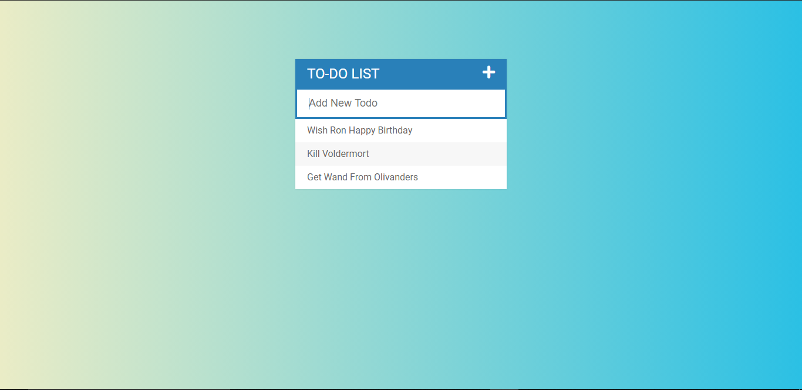
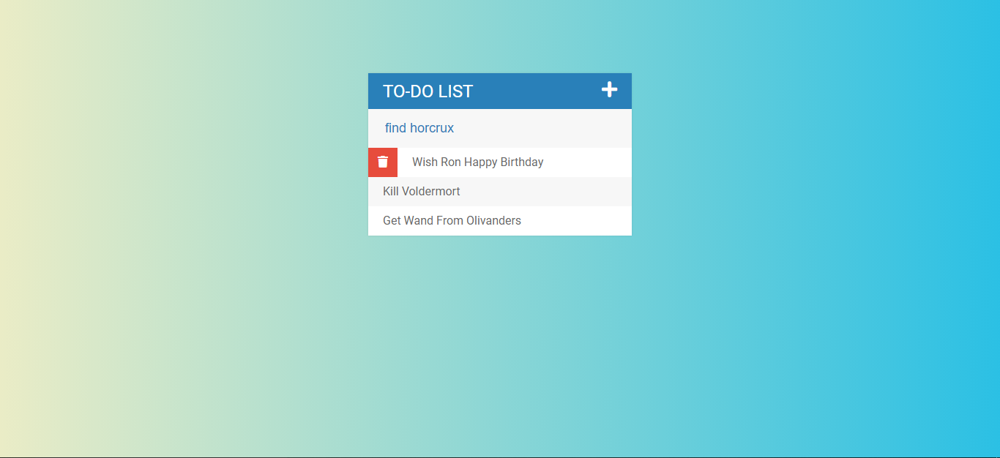
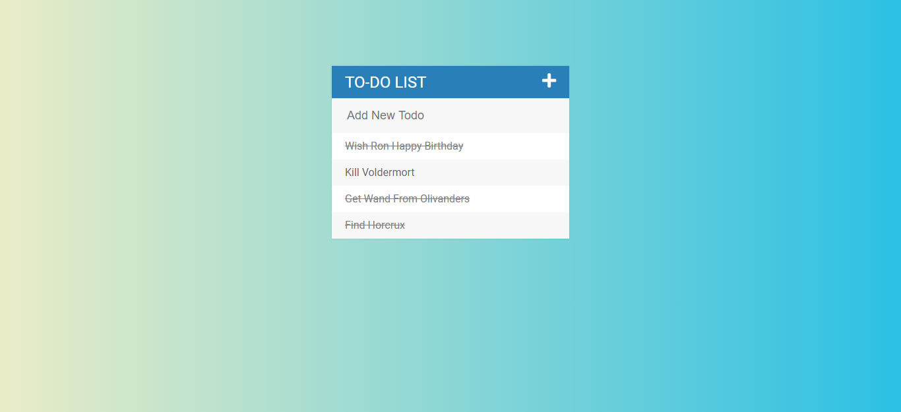

# TO-DO list(fully responsive)
A simple TO-DO list using jQuery as the library for DOM manupulation

Add to your TO-DO's

Delete from your list using floating delete button

Strike from your list if once completed

